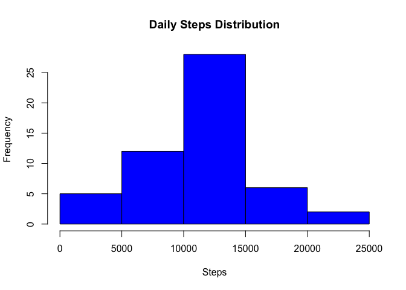
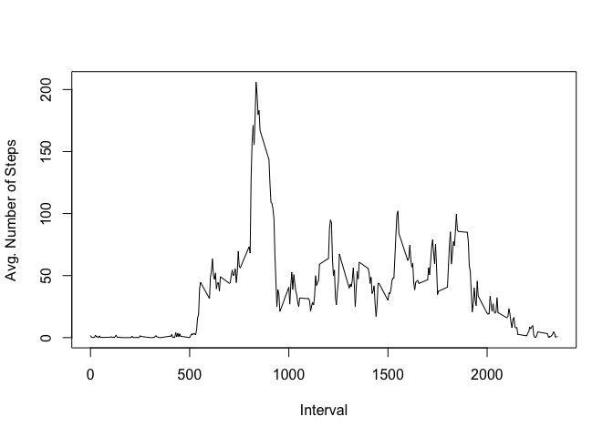
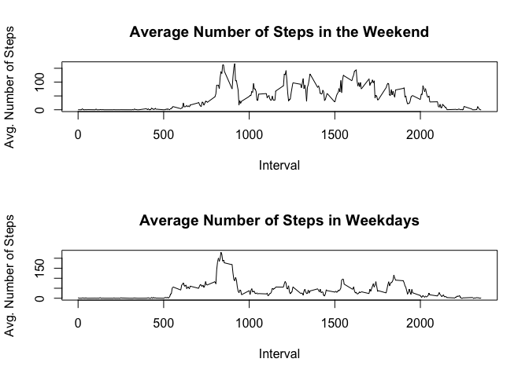

## Loading and preprocessing the data

We will load the data from the same directory where this file is located and replace NAs with 0:


```r
activity_data <- read.csv("activity.csv")
```


## What is mean total number of steps taken per day?

1. We will find out the total number of steps taken per day:


```r
steps_by_day <- aggregate(steps~date, activity_data, sum)
```

2. From the definition at http://www.differencebetween.com/difference-between-bar-graph-and-vs-histogram/, the main differences are:
• First and foremost, a histogram is a development from the bar graph, but it is not identical to a bar graph. Histograms are a type of bar graphs, but bar graphs definitely are not histograms.

• Bar graphs are used to plot categorical or qualitative data while histograms are used to plot quantitative data with the ranges of the data grouped into bins or intervals.

• Bar graphs are used to compare variables while histograms are used to show distributions of variables

• Bar graphs have spaces between two bars while histograms have no spaces between the bars. (The reason is that the x- axis in bar graphs are discrete categorical values while, in histograms, it is either discrete or continuous quantitative).

• Histograms are used to illustrate the density of a variable in intervals; in this case the area of the bar represents the frequency of the variable.

The histogram looks like:


```r
hist(steps_by_day$steps, col='blue', xlab='Steps', main='Daily Steps Distribution')
```

<!-- -->

3. Mean and median of the daily steps are:


```r
sprintf('Mean is: %.0f', mean(steps_by_day$steps))
```

```
## [1] "Mean is: 10766"
```

```r
sprintf('Median is: %i', median(steps_by_day$steps))
```

```
## [1] "Median is: 10765"
```

## What is the average daily activity pattern?

1. Make a time series plot

First we will calculate the mean by 5 min. interval:


```r
average_by_5_min <- aggregate(steps~interval, activity_data, mean)
```

And then we plot the results as a trend line:


```r
plot(x = average_by_5_min$interval, y = average_by_5_min$steps, type = 'l', xlab = 'Interval', ylab = 'Avg. Number of Steps')
```

<!-- -->

2. Which 5-minute interval

We will use the which.max function to get the interval with highest average of steps:


```r
max_avg <- average_by_5_min$interval[which.max(average_by_5_min$steps)]
sprintf('The interval with the highest average number of steps is: %.0f', max_avg)
```

```
## [1] "The interval with the highest average number of steps is: 835"
```

## Imputing missing values

1. Calculate and report the total number of missing values in the dataset

We will count the number of NAs in the steps column


```r
na_num <- sum(is.na(activity_data$steps))
sprintf('There are %i NA values', na_num)
```

```
## [1] "There are 2304 NA values"
```

2. Devise a strategy for filling in all of the missing values in the dataset.

We will use the mean of the interval across all days to fill in the NA values.

3. Create a new dataset that is equal to the original dataset but with the missing data filled in.


```r
# We iterate over all rows in the activity_data data frame and replace steps with the average of the interval.
activity_data_clean <- activity_data
for (row in 1:nrow(activity_data_clean)) { 
  if(is.na(activity_data_clean$steps[row])){
    activity_data_clean$steps[row] <- average_by_5_min$steps[average_by_5_min$interval==activity_data_clean$interval[row]] 
  } 
}
```

4. Make a histogram of the total number of steps taken each day and Calculate and report the mean and median total number of steps taken per day

We will repeat the same process as with the initial data set:


```r
steps_by_day_clean <- aggregate(steps~date, activity_data_clean, sum)
sprintf('Mean is: %.0f', mean(steps_by_day_clean$steps))
```

```
## [1] "Mean is: 10766"
```

```r
sprintf('Median is: %.0f', median(steps_by_day_clean$steps))
```

```
## [1] "Median is: 10766"
```

The mean is the same, but the median has changed slightly.

## Are there differences in activity patterns between weekdays and weekends?

1. Create new factor variable


```r
# As a first step, we will be convert the date column from factor to date type
activity_data_clean$date <- as.Date(activity_data_clean$date)
```

```
## Warning in strptime(xx, f <- "%Y-%m-%d", tz = "GMT"): unknown timezone
## 'default/Asia/Bangkok'
```

```r
# Create a vector of weekdays
weekdays1 <- c('Monday', 'Tuesday', 'Wednesday', 'Thursday', 'Friday')
# Get the
activity_data_clean$day_type <- c('Weekend', 'Weekday')[(weekdays(activity_data_clean$date) %in% weekdays1)+1L]
```

2. Make a panel plot containing a time series plot


```r
# First we get the mean aggregation by
average_by_day_type <- aggregate(steps~day_type+interval, activity_data_clean, mean)

# Then we set the canvas to accept two plots
par(mfrow=c(2,1))

# And we draw the plots
plot(
   x = average_by_day_type$interval[average_by_day_type$day_type=='Weekend'],
   y = average_by_day_type$steps[average_by_day_type$day_type=='Weekend'],
   type = 'l',
   main = 'Average Number of Steps in the Weekend',
   xlab = 'Interval',
   ylab = 'Avg. Number of Steps'
)
plot(
   x = average_by_day_type$interval[average_by_day_type$day_type=='Weekday'],
   y = average_by_day_type$steps[average_by_day_type$day_type=='Weekday'],
   type = 'l',
   main = 'Average Number of Steps in Weekdays',
   xlab = 'Interval',
   ylab = 'Avg. Number of Steps'
)
```

<!-- -->
